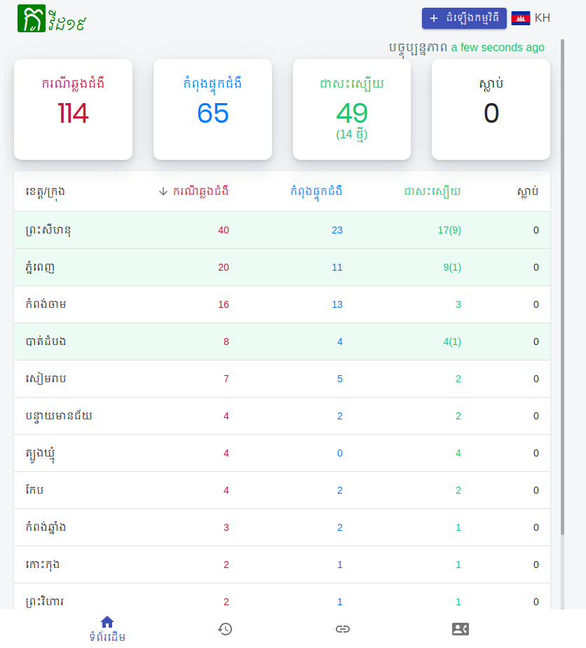

# Cambodia Covid19 Tracker

Covid19KH is a project for sharing information related to Covid19 in Cambodia.



## Prerequisites

You need to have:
- sourcecode: `https://github.com/RathanakSreang/cambodia-covid19-tracker`
- ruby-2.5.1
- redis install
- Airtable account

create `.env` inside project folder and fill:
```
  AIR_TABLE_API_KEY=
  AIR_TABLE_APP_KEY=
```

## Installation

- API server:
  ```
    cd cambodia-covid19-tracker
    bundle install
  ```

- Frontend:
  ```
    cd cambodia-covid19-tracker/frontend
    yarn
  ```

## Development
- API server:
  ```
    cd cambodia-covid19-tracker
    rails server
  ```

- Frontend:
  ```
    cd cambodia-covid19-tracker/frontend
    yarn start
  ```

Now you can start add your code.

## Deployment
- API

  ....


- Frontend

  run these command:
  ```
     cd cambodia-covid19-tracker/frontend
     yarn build # build production code
     rm -rf production #remove old code
     cp -RT build production # copy new build code
  ```

## Database

For this app the data is store at: https://airtable.com/shr9ta8lqYMyuLp3O

## Contributing
Pull requests are welcome. For major changes, please open an issue first to discuss what you would like to change.


## License
[MIT](https://choosealicense.com/licenses/mit/)
